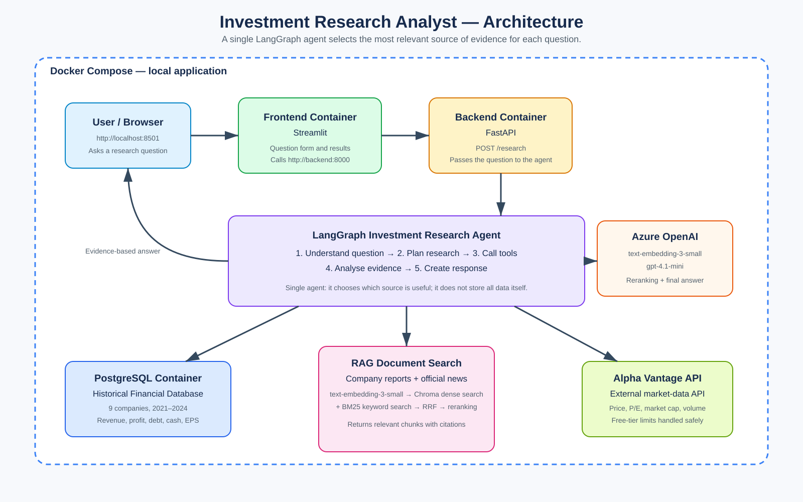

# Investment Research Analyst Agent

An educational single-agent application for researching and comparing nine companies. It combines structured historical financial figures, recent market data, and company documents to produce cited research answers. It does not provide personalised financial advice or guarantee investment outcomes.

## Problem statement

Investment research involves different kinds of evidence. Historical numbers are best handled as structured data, while business risks and company developments are found in long documents. This project demonstrates how one agent can select the most appropriate source for a user's question and explain its answer with evidence.

## Example questions

```text
How has Microsoft's revenue changed from 2021 to 2024?
What are Apple's main business risks?
What recent developments has Nvidia announced?
Compare Microsoft and Apple as investments using the available data.
Which companies in this project require the most caution, and why?
I have 1000 GBP to invest. Give me a balanced educational example strategy.
```

## Architecture



```text
Browser -> Streamlit -> FastAPI -> LangGraph agent -> PostgreSQL / RAG / Alpha Vantage
```

## Components

| Component | Role |
|---|---|
| Streamlit | Browser interface for general research or an educational example strategy. |
| FastAPI | HTTP interface; `/research` sends a validated request to the agent. |
| LangGraph | Orchestrates the single agent through understanding, planning, tools, analysis, and response steps. |
| PostgreSQL | Historical structured financial data for 9 companies from 2021-2024. |
| Alpha Vantage | Current/recent market-data API, subject to free-tier limits. |
| RAG | Searches selected annual-report/risk extracts and official-news documents. |
| Dense retrieval | Azure `text-embedding-3-small` plus Chroma semantic vector search. |
| BM25 | Keyword-based sparse retrieval. |
| RRF | Combines dense and BM25 rankings. |
| Reranking | Azure `gpt-4.1-mini` reorders candidate RAG chunks by relevance. |
| Docker Compose | Runs frontend, backend, and PostgreSQL locally as containers. |

The agent uses `gpt-4.1-mini` for RAG reranking and final answer generation. LangGraph, Chroma, BM25, PostgreSQL, and Alpha Vantage are not language models.

## Repository structure

```text
app/
  agent/        LangGraph workflow, state, nodes, prompts, and tool wrappers
  backend/      FastAPI application and backend Dockerfile
  database/     SQLAlchemy model, connection, queries, and SimFin import
  frontend/     Streamlit application, HTTP client, and frontend Dockerfile
  market_data/  Alpha Vantage client and normalisation service
  rag/          Loaders, chunking, embeddings, Chroma, BM25, RRF, reranking
data/
  documents/rag/  Company-document source files
  chroma/         Persistent local Chroma vector index
docs/             Architecture diagram, AWS guide, and final checklist
evaluation/       Evaluation questions and generated routing results
scripts/          Manual setup, ingestion, testing, and evaluation commands
tests/            Automated pytest suite
```

## Local setup

Requirements:

- Python 3.12
- [uv](https://docs.astral.sh/uv/)
- Docker Desktop

Create local settings without committing secrets:

```powershell
Copy-Item .env.example .env
uv sync
```

Fill in the PostgreSQL password, Azure OpenAI settings, and Alpha Vantage key in `.env`. Never commit `.env`.

## Environment variables

| Variable group | Purpose |
|---|---|
| `POSTGRES_*` | Database host, port, database name, user, and password. |
| `ALPHA_VANTAGE_API_KEY` | Current/recent market-data access. |
| `AZURE_ENDPOINT`, `AZURE_API_KEY` | Azure OpenAI access. |
| `EMBED_DEPLOYMENT`, `EMBED_API_VERSION` | RAG embedding deployment. |
| `CHAT_DEPLOYMENT`, `CHAT_API_VERSION` | Reranking and final-answer chat deployment. |
| `BACKEND_URL` | Address Streamlit uses to call FastAPI. |
| `BACKEND_TIMEOUT_SECONDS` | Frontend HTTP timeout. |

See `.env.example` for safe placeholders and local/Docker hostname guidance.

## PostgreSQL

Start only PostgreSQL for local Python development:

```powershell
docker compose up -d postgres
uv run python scripts/initialize_database.py
uv run python scripts/import_simfin_data.py
```

The database contains one `historical_financials` table with 36 records: 9 companies across 2021-2024.

## RAG documents and indexing

The active presentation corpus has 18 documents: one annual-report/risk extract and one official-news item for each of the nine companies. Full source files may remain archived on disk but are not all searched, which reduces latency and Azure usage.

Build the persistent Chroma index after changing active documents:

```powershell
uv run python scripts/build_rag_index.py
```

This sends document chunks to the configured Azure embedding deployment and may consume Azure quota or incur usage charges.

## Run services outside Docker

Backend:

```powershell
uv run uvicorn app.backend.main:app --reload --host 0.0.0.0 --port 8000
```

Frontend, in a second terminal:

```powershell
uv run streamlit run app/frontend/streamlit_app.py
```

Open `http://localhost:8501`. FastAPI documentation is available at `http://localhost:8000/docs`.

## Run with Docker Compose

Build and start the full application:

```powershell
docker compose up -d --build
docker compose ps
```

Open `http://localhost:8501`.

Inside Docker, service names are used rather than `localhost`:

- frontend calls `http://backend:8000`;
- backend connects to `postgres:5432`.

The backend bind-mounts `data/documents/rag` and `data/chroma`. PostgreSQL uses the persistent `postgres_data` Docker volume.

Stop containers while preserving the database:

```powershell
docker compose down
```

Do not run `docker compose down -v` unless you deliberately want to delete the PostgreSQL volume.

Logs:

```powershell
docker compose logs -f backend
docker compose logs -f frontend
```

## Tests and evaluation

Run automated tests:

```powershell
uv run pytest
```

Run the routing evaluation:

```powershell
uv run python scripts/evaluate_agent.py
```

This default evaluation checks ten representative questions without calling external services. Results are saved to `evaluation/results.json` and show expected tools, actual tools, pass/fail, warnings, and source counts.

Optional live evaluation calls Azure and Alpha Vantage, so run only a small subset when quota and costs are acceptable:

```powershell
uv run python scripts/evaluate_agent.py --live --limit 2
```

## Example output

For `How has Microsoft's revenue changed?`, the agent selects PostgreSQL and returns the 2021-2024 revenue trend. For `What are Apple's main business risks?`, it selects RAG and returns relevant annual-report evidence with source metadata.

## AWS deployment

The recommended simple training-project deployment is one EC2 instance running the existing Docker Compose stack. AWS was not deployed from this machine because no AWS profile, credentials, or region is configured. This is intentionally documented rather than faking a cloud deployment.

See [AWS deployment guide](docs/aws-deployment.md) for the recommended architecture, configuration values, security notes, and reproducible commands.

## Limitations

- The company universe is limited to nine selected companies.
- Historical financial data currently covers 2021-2024.
- The active RAG corpus is deliberately compact; it is not a complete archive of every company filing.
- Alpha Vantage free-tier limits can make current market data unavailable temporarily.
- The model can provide educational research examples, not guaranteed forecasts, buy/sell instructions, or personalised regulated financial advice.
- AWS deployment requires a configured AWS account and may incur cloud charges.

## Future improvements

- Expand company documents and news coverage.
- Use a higher-quota market-data provider.
- Add financial ratios and transparent portfolio/risk scoring.
- Add observability, richer evaluation, and user authentication if required.
- Move from the simple EC2 Compose deployment to managed RDS, object storage, and managed container services for a larger production system.

## Final verification

See [the final project checklist](docs/final-checklist.md) for verified components, evaluation status, and the AWS deployment blocker.
